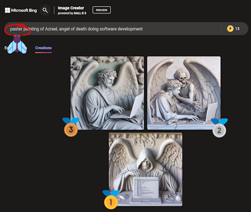
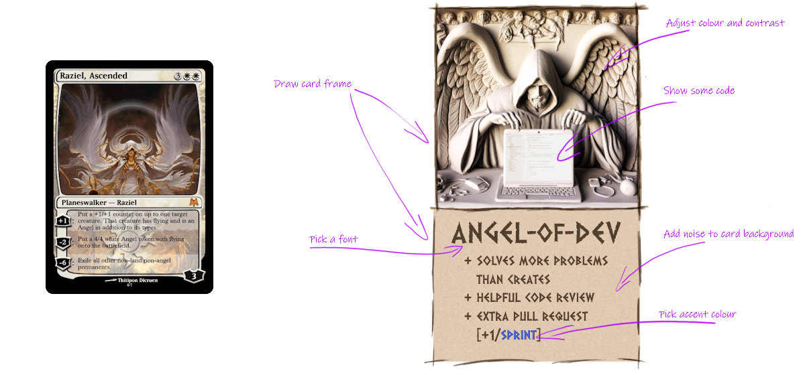
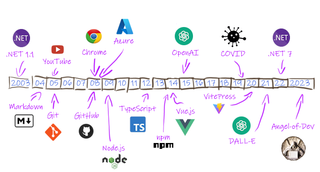

# How This Site Was Made

It was a rainy autumn day and Spotify played [Azrael](https://www.youtube.com/watch?v=YsBGIhaRBoc) by [HVOB](https://en.wikipedia.org/wiki/HVOB), pinned to the top of my playlist. The title refers to [Azrael, the angel of death](https://en.wikipedia.org/wiki/Azrael), one of four archangels in some Abrahamic religions, but that's not that important.  

When said quickly, `angel of death` sounds close enough to `angel of dev` and that's just perfect for a coding related name.  
Not only is it fun to say out loud (go ahead, try it), but we now also have [.dev](https://en.wikipedia.org/wiki/.dev) domains on sale and [angelof.dev](angelof.dev) is available! Quick shop around and found it for just under $10/year.
Payment is processing so let's speedrun free infrastructure: [github.com/Angel-of-Dev](https://en.wikipedia.org/wiki/GitHub) for code and hosting, [angelofdev@outlook.com](https://en.wikipedia.org/wiki/Outlook.com) for email and access to [DALL-E](https://en.wikipedia.org/wiki/DALL-E) through [Microsoft Bing Image Creator](https://www.bing.com/images/create).

🏅 Infrastructure speedrun complete!

Speak to DALL-E and see what [AI](https://www.youtube.com/watch?v=EUrOxh_0leE) can generate for us today.
Death is a heavy topic so how about we soften it with a pastel painting, for some balance.

Of course, a typo in the very first word... but that's ok, it turned out just fine anyway.

Framing is as important as a picture itself, so open the AI-generated image in [Paint.NET](https://en.wikipedia.org/wiki/Paint.net), add transparent margin and draw a frame around it.

At this point the image starts to remind me of card art used in [Magic: The Gathering](https://en.wikipedia.org/wiki/Magic:_The_Gathering). Look at the card below, it even has similar colour palette so doesn't take much to imagine how **Angel of Dev** card could look like.

Basic design is in place so time to speedrun a website using [VitePress](https://vitepress.dev), configure it to [deploy to GitHub](https://vitepress.dev/guide/deploy#github-pages) and [extend default theme](https://vitepress.dev/guide/extending-default-theme) to use [colour scheme](https://en.wikipedia.org/wiki/Color_scheme) matching the card design, [git](https://git-scm.com/) commit+push and that's that. Done.

## Then vs. Now

The process of creating and "owning" personal website has changed in the past 20 years (which is as far back as my memory allows me to remember). What took two afternoons in 2023 would have taken several more in 2003 as almost all setup and code had to be done "from scratch". Today most of the code is already there and is of great quality out of the box. Also out of the box is [responsive user interface](https://en.wikipedia.org/wiki/Responsive_web_design), [cross-browser compatibility](https://en.wikipedia.org/wiki/Cross-browser_compatibility), [tooling](https://marketplace.visualstudio.com/items?itemName=Vue.volar) and much more. Truly amazing.

Putting past 20 years on a timeline makes it very clear just how much progress has been made thanks to [open source](https://en.wikipedia.org/wiki/Open_source) and **developers** who kindly donated their ideas and time to those projects. Marked at the bottom are technologies and products used for this site, the ones at the top are just for reference.

Thank you for making it so simple. 
Angel of Dev

## But how would it look like in pastel?

Equally nice, but not quite the same. **This time a typo made it better.**

