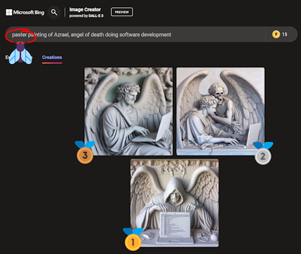
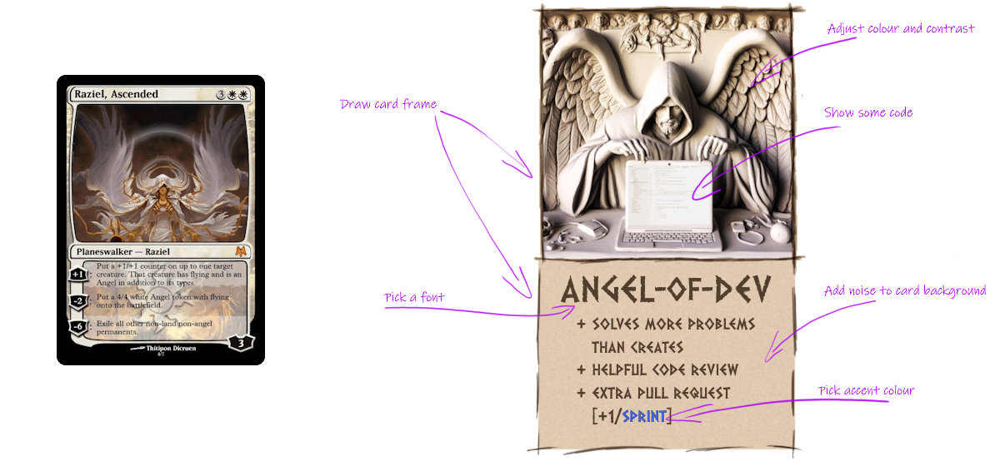

# How This Site Was Made

It was a rainy autumn day and Spotify played [Azrael](https://www.youtube.com/watch?v=YsBGIhaRBoc) by [HVOB](https://en.wikipedia.org/wiki/HVOB), pinned to the top of my playlist. The title refers to [Azrael, the angel of death](https://en.wikipedia.org/wiki/Azrael), one of four archangels in some Abrahamic religions, but that's not that important.  

When said quickly, `angel of death` sounds close enough to `angel of dev` and that's just perfect for a coding related name.  
Not only is it fun to say out loud (go ahead, try it), but we now also have [.dev](https://en.wikipedia.org/wiki/.dev) domains on sale and [angelof.dev](angelof.dev) is available! Quick shop around and found it for under $10 on [porkbun.com](https://porkbun.com/).
While payment is processing, let's speedrun free infrastructure: [github.com/Angel-of-Dev](https://en.wikipedia.org/wiki/GitHub) for code and hosting, [angelofdev@outlook.com](https://en.wikipedia.org/wiki/Outlook.com) for email and access to [DALL-E](https://en.wikipedia.org/wiki/DALL-E) through [Microsoft Bing Image Creator](https://www.bing.com/images/create).

🏅 Infrastructure speedrun complete!

Let's talk to DALL-E and see what [AI](https://www.youtube.com/watch?v=EUrOxh_0leE) can generate for us today.
Death is a heavy topic so how about we soften it with a pastel painting, for some balance.

Of course, a typo in the very first word I typed... but look at that, it turned out just fine anyway!  

Framing is as important as a picture itself, so let's open the winning image in [Paint.NET](https://en.wikipedia.org/wiki/Paint.net), add transparent margin to it and manually draw a frame around it.

At this point the image started to remind me of card art used in games such as [Magic: The Gathering](https://en.wikipedia.org/wiki/Magic:_The_Gathering). Have a look at the card below, it even has similar colour palette so doesn't take much to imagine how **Angel of Dev** card could look like.

With that basic design in place, let's speedrun a website using [VitePress](https://vitepress.dev), configure it to [deploy to GitHub](https://vitepress.dev/guide/deploy#github-pages) and [extend default theme](https://vitepress.dev/guide/extending-default-theme) to use [colour scheme](https://en.wikipedia.org/wiki/Color_scheme) matching the card design, [git](https://git-scm.com/) commit+push and that's that. Done.

Angel of Dev

