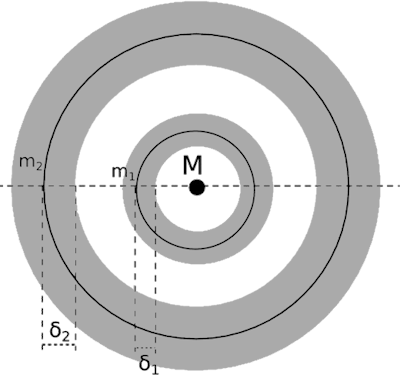

# Orbital Dynamics

::: info Abstract
We build a simple orbital dynamics model that considers natural astronomical bodies in the celestial neighbourhood of Arrakis.

[Read the background story](../the-story/index.md)
:::

## Celestial Neighbourhood

Arrakis is a **third planet** of a [single star system](https://en.wikipedia.org/wiki/Star_system) with day and year length similar to that on Earth.  
It has **two moons** that contribute to its arid climate and harsh weather patterns.  
The larger moon is said to interfere with planet's magnetic field and communication satellites in planet's orbit.

:mag_right: Let's visualize how that would work.

TODO:Image of star system, first two planets excluded from the model

## Problem Exploration

Goals:
* 

### The Hill Sphere

A planet with two moons can be thought of as a stable solution to a [three-body problem](https://en.wikipedia.org/wiki/Three-body_problem).  
More specifically, orbits of both moons must lie within a **gravitational sphere of influence** of the planet, while at the same time they must not influence each other.

We model **sphere of influence** of each celestial body as a [Hill Sphere](https://en.wikipedia.org/wiki/Hill_sphere) with radius:

$R_H=d\cdot\sqrt [3] {m/3(M+m)}$

where $m$ represents a mass of a smaller object orbiting a larger object with mass $M$ that is $d$ distance away.  

### Arrakis Hill Sphere

Computing Hill Sphere of a planet will give us possible locations of stable moons, but first we need to find:
* $m$, the mass of the planet
* $M$, the mass of a start that the planet orbits
* $d$, the distance between the planet and the sun

Since Arrakis is quite similar to Earth, let's approximate parameters with values from our solar system:
* $m=6\cdot10^{24}$ kg, approximate mass of Earth
* $M=2\cdot10^{30}$ kg, approximate mass of Sun
* $d=1$ [Astronomical Unit (AU)](https://en.wikipedia.org/wiki/Astronomical_unit), a distance between Sun and Earth

::: info Benefits of Astronomical Unit (AU)
We could express the distance as $150,000,000$ km, but using AU results in smaller numbers that are slightly easier to work with.  
It also simplifies model parametrization. Rather than having multiple parameters for each distance in a model, we can have a single parameter `AU = x` and compute other distances from it.
:::

$R_H=1\cdot\sqrt [3] {6\cdot10^{24}/3(2\cdot10^{30}+6\cdot10^{24})}=\sqrt [3] {1/1000003}\approx0.01$ AU

Arrakis has a Hill Sphere with a radius approximately $0.01$ AU (~$1,500,000$ km).

> :mag_right: That's enough to fit two moons, but can they follow stable orbits around a planet?

### Orbit Stability

Consider the following setup with:
* $M$, the mass of the planet
* $m_1$, the mass of first moon
* $m_2$, the mass of second moon
* Grey Zone, the stable orbits

---

::: details References
* C. A. Giuppone, M. H. M. Morais, A. C. M. Correia, A semi-empirical stability criterion for real planetary systems with eccentric orbits, Monthly Notices of the Royal Astronomical Society, Volume 436, Issue 4, 21 December 2013, Pages 3547–3556, https://doi.org/10.1093/mnras/stt1831
:::
