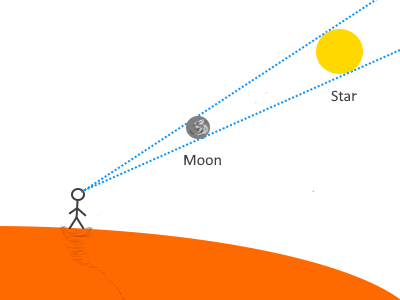
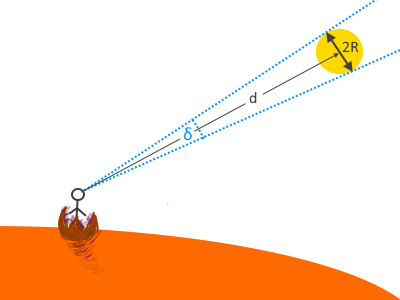
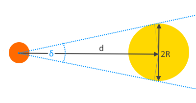

# Orbital Dynamics


> If you wish to make a coffee cup from scratch,  
> you must first invent the universe.
>
> -- [Carl Sagan](https://en.wikipedia.org/wiki/Carl_Sagan) ([probably](https://www.youtube.com/watch?v=zSgiXGELjbc)).

---

::: info Abstract
We build a simple world model that considers natural astronomical bodies in the celestial neighbourhood of planet Arrakis. 
We equip the model with set of parameters and validation logic based on established methods from [celestial mechanics](https://en.wikipedia.org/wiki/Celestial_mechanics).
In addition, we list simplifying assumptions that can be lifted in the future to build more comprehensive models.

[Read the background story](../the-story/index.md)
:::

## Celestial Neighbourhood

Arrakis is a **third planet** of a **single star system** with day and year length similar to that on Earth. It has **two moons** that contribute to its arid climate and harsh weather patterns.  
The larger moon is said to interfere with planet's magnetic field and communication satellites in planet's orbit.


::: tip Simplifying Assumptions
:bookmark: **SA01: Negligible influence of other planets.**  
Other planets are out of scope of the model.

:bookmark: **SA02: Circular orbits.**  
Orbits of all celestial bodies are circular.  
The [mean orbital velocity](https://en.wikipedia.org/wiki/Orbital_speed) of each celestial body is constant.
:::

## Discovery I: Mechanics of Stable Orbits

The motion of a planet and its two moons can be thought of in terms of [Newton's laws of motion](https://en.wikipedia.org/wiki/Newton%27s_laws_of_motion) and a [three-body problem](https://en.wikipedia.org/wiki/Three-body_problem).
We are only interested in solutions that are stable over very long period of time, where orbits of moons lie within a **gravitational sphere of influence** of the planet and moons do not influence each other. 

The radius of sphere of influence is estimated in terms of distance between two objects and their mass ratio as:

::: tip [1] Radius of sphere of influence
$R \approx d \cdot \left(\dfrac {m}{M}\right)^{2/5} \approx d \cdot \left(\sqrt [5] {\dfrac {m}{M}}\right)^2$
:::

where:
* $M$, the mass of a larger object
* $m$, the mass of a smaller object
* $d$, the distance between objects


::: info Other Estimators
[Hill Sphere](https://en.wikipedia.org/wiki/Hill_sphere) is another popular model for estimating sphere of influence:  

$R=d \cdot \sqrt [3] {\dfrac {m}{3(M+m)}}$

Both estimators produce similar results and our choice of estimator is arbitrary.
::: 


### Arrakis Radius of Influence

Computing radius of influence of a planet provides possible locations of stable moon orbits.

We start by approximating parameters with values from our solar system:
* $m=6 \cdot 10^{24}$ kg, the approximate mass of Earth
* $M=2 \cdot 10^{30}$ kg, the approximate mass of Sun
* $d=1$ [Astronomical Unit (AU)](https://en.wikipedia.org/wiki/Astronomical_unit), the mean distance between Sun and Earth

::: tip [2] Radius of sphere of influence of Arrakis
$R_{Arrakis} \approx 1 \cdot \left(\sqrt [5] {\dfrac {6 \cdot 10^{24}}{2 \cdot 10^{30}}}\right)^2 \approx 0.006 \approx 6 \cdot 10^{-3}$ AU
::: 

The maximum distance between Arrakis and its moon is $6 \cdot 10^{-3}$ AU.


::: info Benefits of Astronomical Unit (AU)
We could express $d$ in kilometers (~150,000,000 km), but using Astronomical Unit results in smaller numbers that are easier to work with.  

Astronomical Unit also simplifies model parametrization by requiring only a single parameter `Astronomical Unit Length` expressed in absolute terms and relating other distances to it in a form or ratios. 
:::

:mag_right: We know the maximum, but what about a minimum distance between a planet and its moon?

### Roche Limit

[Roche Limit](https://en.wikipedia.org/wiki/Roche_limit) is a distance from the planet within which a moon will disintegrate and form rings:

::: tip [3] Roche limit
$D=r \cdot \sqrt [3] {2 \cdot \dfrac {M}{m}}$
:::

where:
* $r$, the radius of moon
* $m$, the mass of moon
* $M$, the mass of planet

We continue by approximating parameters with values form our solar system:
* $M=6 \cdot 10^{24}$ kg, the approximate mass of Earth
* $m=7 \cdot 10^{22}$ kg, the approximate mass of Moon
* $r=1 \cdot 10^{-5}$ AU, the approximate radius of Moon (~1700 km)

::: tip [4] Roche limit of smaller moon
$D_{Moon} \approx 1 \cdot 10^{-5} \cdot \sqrt [3] {2 \cdot \dfrac {6 \cdot 10^{24}}{7 \cdot 10^{22}}}\approx 0.0000555 \approx 5.55 \cdot 10^{-5}$ AU
:::

The minimum distance between center of Arrakis and center of its smaller moon is $5.55 \cdot 10^{-5}$ AU.

:mag_right: That's good to know, but what about a minimum distance between the moons?

### Moon Stability Criterion

Consider the following setup:


where:
* $M$, the mass of the planet
* $m_i$, the mass of $i$-th moon
* $r_i$, the radius of $i$-th moon orbit

Each moon generates a region of instability with radius $\delta_i$ represented as a gray ring along the path of its orbit. The orbits are stable when those regions do not overlap.  

We approximate $\delta_i$ as:

::: tip [5] $i$-th moon instability radius
$\delta_i \approx k \cdot R_i$
:::

where:
* $k$, the arbitrary instability constant
* $R_i$, the radius of sphere of influence of $i$-th moon

To compute $\delta_i$ of the first room we approximate parameters with values from our solar system and choose the value of $k$:
* $d_1=2.57 \cdot 10^{-3}$ AU, the average distance from Earth to Moon (~384,400 km)
* $k=5$, the arbitrarily chosen value of instability constant

::: tip [6] Radius of sphere of influence of first moon
$R_1 \approx 2.57 \cdot 10^{-3} \cdot \left(\dfrac {7 \cdot 10^{22}}{6 \cdot 10^{24}}\right)^{2/5} \approx 4 \cdot 10^{-4}$
:::

::: tip [7] Instability radius of first moon
$\delta_1 \approx 5 \cdot R_1 \approx 2 \cdot 10^{-3}$
:::


Next we could calculate maximum allowed mass of the second moon and a radius of its orbit, but we stop discovery here and shift attention to the model implementation.

---
::: details References
* Seefelder, Wolfgang (2002). [Lunar Transfer Orbits Utilizing Solar Perturbations and Ballistic Capture](https://www.google.co.uk/books/edition/Lunar_Transfer_Orbits_Utilizing_Solar_Pe/NVg_vYHePt0C). Munich: Herbert Utz Verlag. p. 76. ISBN 3-8316-0155-0
* C. A. Giuppone, M. H. M. Morais, A. C. M. Correia, [A semi-empirical stability criterion for real planetary systems with eccentric orbits](https://doi.org/10.1093/mnras/stt1831), Monthly Notices of the Royal Astronomical Society, Volume 436, Issue 4, 21 December 2013, Pages 3547–3556
:::

## Celestial Model I

:mag_right: We have a fancy name, but what do we actually want the model to do?

### The Purpose

The value of a model comes from its ability to emulate characteristics and behaviour of "something" in a way that can be processed by an "observer".

Here that "something" is **the environment** of a planet and the "observer" is a [somewhat-autonomous vending machine](../the-story/index.md#stilgar-i-the-first-vending-machine).

Machine uses sensors to observe environment, repeated observations reveal recurring patterns, understanding patterns prepares for the future and being prepared improves outcomes once that future becomes the present.

More specifically, the model must emulate natural patterns resulting from the passing of time, such as:
* Day and night cycle (changes to temperature, light exposure and tides)
* Seasons (changes to length of day and night)
* Electromagnetic field fluctuation (impact on communication systems and sand storms on Arrakis)
* Solar eclipses

Each moment of time different planetary regions experience different stages of same cyclical patterns, transitioning smoothly from one phase to another and so the model must be computable not only with respect to time, but also the place.

### Geocentric View

It would be natural to begin with star at the center of the system and the planet revolving around in its orbit,
but for the purpose of this model we shift reference frame and place the planet at the center instead.

From now on we refer to Arrakis as a `Reference Planet`.

We define `Reference Length` ($m$) as a distance from the center of the reference planet to the center of its star (similar to how real [Astronomical Unit](https://en.wikipedia.org/wiki/Astronomical_unit) is defined for Earth and Sun). 
We go a few steps further and also define:
* `Reference Mass` ($kg$) as a mass of the reference planet
* `Reference Density` ($\dfrac {kg}{m^3}$) as a density of reference planet
* `Reference Time` ($s$) as a time needed for the reference planet to complete one orbit around its star

Reference units are always defined in terms of [SI base units](https://en.wikipedia.org/wiki/SI_base_unit).

```csharp
// Based on approximate distance of Earth and Sun, expressed in [m].
double ReferenceLength = 150_000_000_000;
// Based on approximate orbital period of Earth (1 year), expressed in [s].
double ReferenceTime = 360 * 24 * 60 * 60;
// Based on approximate mass of Earth, expressed in [kg].
double ReferenceMass = 6 * Math.Pow(x: 10, y: 24);
// Based on approximate density of Earth, expressed in [kg/m^3]
double ReferenceDensity = 5500;
```

Those definitions allow us to simplify initial configuration of the model. Planet's properties are simple:

```csharp
ReferencePlanet = new CelestialBodyOptions
{
    Mass = 1,
    Density = 1,
    OrbitRadius = 1,
    OrbitalPeriod = 1
};
```

Properties of other celestial bodies are expressed as fractions of reference length, mass, density and time, with relatively small and readable numbers that are easy to make sense of:

```csharp
Star = new CelestialBodyOptions
{
    // Star has 333,333 times more mass than Reference Planet
    Mass = 333333,
    // Star is less dense than Reference Planet, by a factor of 0.255.
    Density = 0.255,
    // Star does not orbit anything in our model
    OrbitRadius = 0,
    OrbitalPeriod = 0
};

SmallMoon = new CelestialBodyOptions
{
    Mass = 0.0060,
    Density = 0.4,
    // Radius of moon's orbit is equal to 0.1% of planet's orbit radius.
    OrbitRadius = 0.001,
    // Moon orbits planet in 1% of time it takes planet to orbit the star.
    OrbitalPeriod = 0.01
};

LargeMoon = new CelestialBodyOptions
{
    Mass = 0.0116,
    Density = 0.6,
    OrbitRadius = 0.00257,
    OrbitalPeriod = 0.0861
};
```

### Anti-Pattern: Primitive Obsession (aka Missing Abstraction)

Let's try to compute Radius of Influence and Roche Limit for our planet.  
A quick draft of implementation could look like this:

```csharp
double planetROI = ComputeROI(planet.Mass, planet.OrbitRadius, Star.Mass);
double planetRocheLimit = ComputeLimit(planet.Mass, planet.Radius, Star.Mass);

// Computes the radius of influence, that is the maxium distance
// from center celestial body to center of its stable satellite.
private double ComputeROI(double mass,
                          double orbitRadius,
                          double primaryMass)
{
    Guard.NotInfinityOrNaN(mass);
    Guard.NotInfinityOrNaN(orbitRadius);
    Guard.NotInfinityOrNaN(primaryMass);
    
    var massRatio = mass / primaryMass;
    var scaledRatio = Math.Pow(massRatio, 2.0 / 5.0);
    var distanceToPrimary = orbitRadius;
    
    var radiusOfInfluence = distanceToPrimary * scaledRatio;
    Expect.NotInfinityOrNaN(radiusOfInfluence);
    
    return radiusOfInfluence;
}

// Computes the Roche Limit, that is the minimum distance from center
// of a celestial body to center of its primary (i.e. body that it orbits).
private double ComputeLimit(double mass,
                            double radius,
                            double primaryMass)
{
    Guard.NotInfinityOrNaN(mass);
    Guard.NotInfinityOrNaN(radius);
    Guard.NotInfinityOrNaN(primaryMass);
    
    var quotient = 2 * primaryMass / bodyMass;
    
    var rocheLimit = bodyRadius * Math.Cbrt(quotient);
    Expect.NotInfinityOrNaN(rocheLimit);
    
    return rocheLimit;
}
```

Notice how we store measurements in variables of type [double](https://learn.microsoft.com/en-us/dotnet/api/system.double?view=net-8.0).
The choice of type is good enough for what we need, but other than "real" numbers,
`double` can also represent [NaN (Not a Number)](https://learn.microsoft.com/en-us/dotnet/api/system.double.nan?view=net-8.0#system-double-nan)
and [Infinity](https://learn.microsoft.com/en-us/dotnet/api/system.double.isinfinity?view=net-8.0#system-double-isinfinity(system-double)).
Those values cannot be processed by model calculations, forcing us to check arguments frequently (here with `Guard` statements).  

On top of that the code isn't clear about units in which the measurements should be provided (kilograms? imperial pounds?),
so we would need to comment the code quite heavily to make units very clear.  

Lastly, it would be rather easy to accidentally pass value of `mass` in place of a `radius` as there's no way for a compiler to detect such scenario,
so this code would need to rely heavily on careful code reviews and unit tests. Not great.

We fix this by introducing more specialised types that encapsulate validation logic and allow tests and documentation to live close together:

```csharp
/// <summary> Represents a measure of length expressed in meters [m]. </summary>
internal readonly struct Length
{
    private readonly double _value;

    /// <summary> Initializes a new instance of <see cref="Length"/>. </summary>
    /// <param name="value"> The value expressed in [m]. Must not be infinity or NaN. </param>
    public Length(double value)
    {
        Guard.NotInfinityOrNaN(value);

        _value = value;
    }

    /// <summary> Casts the <see cref="double"/> to <see cref="Length"/>. </summary>
    /// <remarks> Choice of explicit cast was made to help communicate intent and make accidental mistakes easier to spot. </remarks>
    public static explicit operator Length(double value) => new(value);

    /// <summary> Casts the <see cref="Length"/> to <see cref="double"/>. </summary>
    public static implicit operator double(Length length) => length._value;

    /// <inheritdoc/>
    public override string ToString() => $"{_value.ToString("F", CultureInfo.InvariantCulture)} [m]";
}

// Similar implementation for Mass, Density and Time.
```

It is now possible to rewrite draft of computation code to a much more readable and type-safe form:

```csharp

Length planetROI = ComputeROI(planet.Mass, planet.OrbitRadius, Star.Mass);
Length planetRocheLimit = ComputeLimit(planet.Mass, planet.Radius, Star.Mass);

// Computes the radius of influence, that is the maxium distance
// from center celestial body to center of its stable satellite.
private Length ComputeROI(Mass mass,
                          Length orbitRadius,
                          Mass primaryMass)
{
    var massRatio = mass / primaryMass;
    var scaledRatio = Math.Pow(massRatio, 2.0 / 5.0);
    var distanceToPrimary = orbitRadius;

    return (Length)(distanceToPrimary * scaledRatio);
}

// Computes the Roche Limit, that is the minimum distance from center
// of a celestial body to center of its primary (i.e. body that it orbits).
private Length ComputeLimit(Mass mass,
                            Length radius,
                            Mass primaryMass)
{
    var quotient = 2 * primaryMass / bodyMass;    

    return (Length)(bodyRadius * Math.Cbrt(quotient));
}
```


::: info Using third-party libraries
In practice using existing open-source libraries such as [UnitsNet](https://github.com/angularsen/UnitsNet) might be simpler than implementing your own definitions, but it all depends on a context.  

For example, UnitsNet.dll is ~2MB dependency which may not be desired in some Internet Of Things (IoT) scenarios, or its license may prohibit its use on a fictional desert planet.
:::

## Discovery II: Solar Eclipses and Solar Irradiance

We leave the code for a moment to look at theory behind **solar eclipses** and **solar irradiance** (the amount of power received by the planet from its star).

### Total Solar Eclipse

On Earth, [total solar eclipse](https://en.wikipedia.org/wiki/Solar_eclipse) happens when when Moon fully obstructs the view of Sun. This phenomenon occurs somewhere on Earth every several months, but very rarely in the same place.
This is because Moon's and Earth's orbits are not perfectly circular and their orbital planes are not perfectly aligned.



Our model already assumes perfectly circular orbits [see :bookmark:[SA02](#celestial-neighbourhood)] but it does not say much about orbital planes. Let's do that now.

::: tip Simplifying Assumptions
:bookmark: **SA03: Aligned orbital planes.**  
[Orbital planes](https://en.wikipedia.org/wiki/Orbital_plane) of all celestial bodies are aligned.
:::

This assumption ensures that eclipses can be observed regularly from the same place on a planet.

### Point of View and Apparent Size

Not every planet with a moon experiences eclipses, many never do. For example, when moon is too small or too far away,
its apparent size (as seen from the planet's surface) is smaller than the apparent size of the star, making eclipses impossible.

This "apparent size" can be described mathematically as [angular diameter](https://en.wikipedia.org/wiki/Angular_diameter#Use_in_astronomy):

$\delta \approx \dfrac {2R}{d}$

where:
* $\delta$, the apparent size of distant object, here expressed in [radians](https://en.wikipedia.org/wiki/Radian)
* $R$, the radius of distant object
* $d$, the distance of the object from observer



**Apparent size** is normally expressed in [arcseconds](https://en.wikipedia.org/wiki/Minute_and_second_of_arc)
instead of [radians](https://en.wikipedia.org/wiki/Radian) and this is also how we will express it from now on, approximating $1$ radian as $2.06 \cdot 10^5$ arcseconds:

$\delta \approx 2.06 \cdot 10^5 \cdot \dfrac {2R}{d}$ **arcseconds**

Setting parameters with values from our solar system:
* $R=698,252,813$ meters, radius of Sun
* $d=1.5 \cdot 10^{11}$ meters, distance from Earth to Sun



::: tip [8] Apparent Size of Sun
$\delta_{Sun} \approx 2.06 \cdot 10^5 \cdot \dfrac {2R}{d} \approx 2.06 \cdot 10^5 \cdot \dfrac {2 \cdot 698,252,813}{1.5 \cdot 10^{11}} \approx 1,918$ **arcseconds**
:::

and for the Moon:
* $R=1,713,966$ meters, radius of Moon
* $d=3.84 \cdot 10^{8}$ meters, distance from Earth to Moon

::: tip [9] Apparent Size of Moon
$\delta_{Moon} \approx 2.06 \cdot 10^5 \cdot \dfrac {2R}{d} \approx 2.06 \cdot 10^5 \cdot \dfrac {2 \cdot 1,713,966}{3.84 \cdot 10^{8}} \approx 1,832$ **arcseconds**
:::

### Total Eclipse Possibility Criterion

Total eclipses are always possible when Moon seems bigger than the Sun ($\delta_{Moon} \ge \delta_{Sun}$) but since human eye can only resolve diameters of approximately 1 arcminute (60 arcseconds), it seems reasonable to allow some margin of error for the criterion. We'll use 2 arcminutes (120 arcseconds) for a good measure.

::: tip [10] Total Eclipse Possibility Criterion
$\text{ Total Eclipse Possible} = \begin{cases}
true  & \delta_{Moon} \ge -120+\delta_{Sun}  \\
false & \text{ otherwise}
\end{cases}$
:::

Substituting previously calculated values the criterion correctly predicts that total eclipse is be possible:

$\delta_{Moon} \ge -120+\delta_{Sun}$  
$1832 \ge -120+1918$  
$1832 \ge 1798$  
$34 \ge 0$


---
::: details References
* Michael A. Seeds; Dana E. Backman (2010). [Stars and Galaxies (7 ed.)](https://www.google.co.uk/books/edition/Foundations_of_Astronomy/Cf82ygAACAAJ?hl=en). Brooks Cole. ISBN 978-0-538-73317-5.
:::

### TO BE CONTINUED