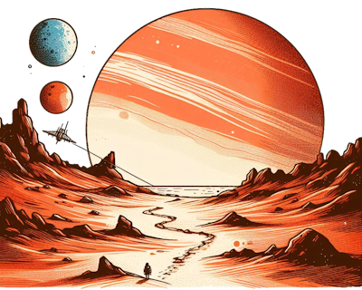

> A ruler must learn to persuade and not to compel.  
> He must lay the best coffee hearth to attract the finest men.
>
> -- [Frank Herbert](https://en.wikipedia.org/wiki/Frank_Herbert), [Dune](https://archive.org/details/frank-herberts-dune-saga-collection-books-1-6-by-frank-herbert/mode/2up)

A sound advice given to [Paul Atreides](https://en.wikipedia.org/wiki/Paul_Atreides) in the opening act of Frank Herbert's Dune.  
Some say that those words marked the beginning of **The Dune Coffee Company** that quickly seeded the whole planet Arrakis (known as Dune) with a network of vending machines serving the best [spice coffee](https://www.reddit.com/r/dune/comments/tcw924/i_made_as_best_i_could_dune_spice_coffee/) to the local [Fremen](https://en.wikipedia.org/wiki/Fremen) population.

> :mag_right: But how exactly do you manage a fleet of thousands of vending machines on a remote planet? 

In this series we will use [.Net](https://en.wikipedia.org/wiki/.NET_Framework)/[C#](https://en.wikipedia.org/wiki/C_Sharp_%28programming_language%29) to model individual machines and [Internet of Things (IoT)](https://en.wikipedia.org/wiki/Internet_of_things) infrastructure linking them together. 
We will build [machine learning](https://en.wikipedia.org/wiki/Machine_learning) models to detect patterns in how devices are used, optimize their performance and give them some degree of autonomy. 
We will explore number of architecture and testing patterns to verify code and evolve models in a safe and predictable way.

## How Coffee Vending Works (on Arrakis)

Let's start by having a closer look at how coffee works on our desert planet.  

**Water** is really hard to find on a dry surface of Arrakis, but luckily "wind trapping" technology can reclaim some of the ambient moisture, usually by cooling air below its [dew point](https://en.wikipedia.org/wiki/Dew_point). 
**Coffee beans**, **honey**, **donkey milk** (yikes!) and [The Spice](https://en.wikipedia.org/wiki/Melange_(fictional_drug)) are all sourced from the Fremen who live in communities called **sietches** and that's where we will deploy our first vending machine.

## Stilgar I, The First Vending Machine

**Stilgar I** uses small **solar panels** to power its **batteries**. 
It normally needs a few minutes of morning light to generate enough electricity to keep it going until the next day. 
Its **wind trap** works tirelessly (usually over night when temperature drops) to collect water needed to prepare drinks.   

Coffee beans, milk and other ingredients are replenished regularly by subcontractors working for a local **Sietch Authorities** who also provide security and maintenance of the machines. 
Each **Sietch Authority** operates differently, with some taking a flat fee for their services (paid in **Solari**, the local currency), a cut of a profit from each cup sold or a mixture of both.  

Communication between machines and "The Cloud" uses satellite network link with an adequate level of connectivity at a rather high cost. 
Connection is easily disrupted by frequent sand storms tumbling tirelessly across the planet and by strong magnetic field of one of its moons.

> :mag_right: Wait, "one" of its moons? How many are there?!  
> Find out in [the next part of the story](../orbital-dynamics/).

